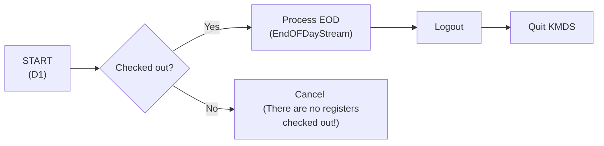
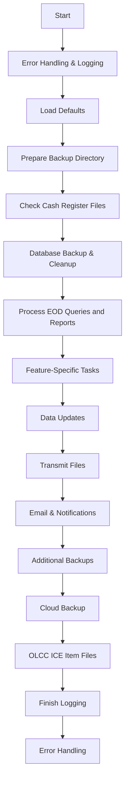
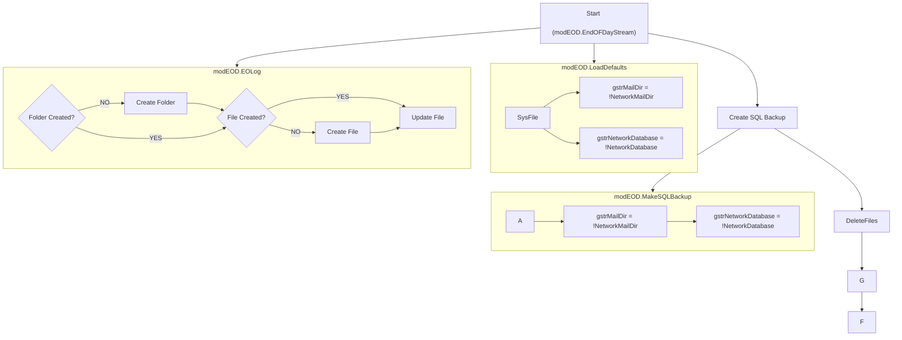
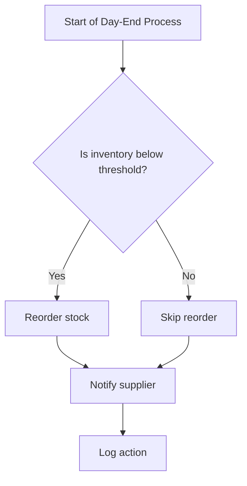
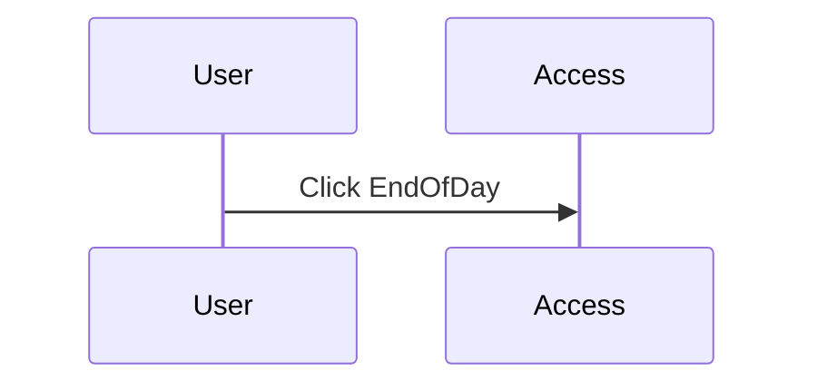
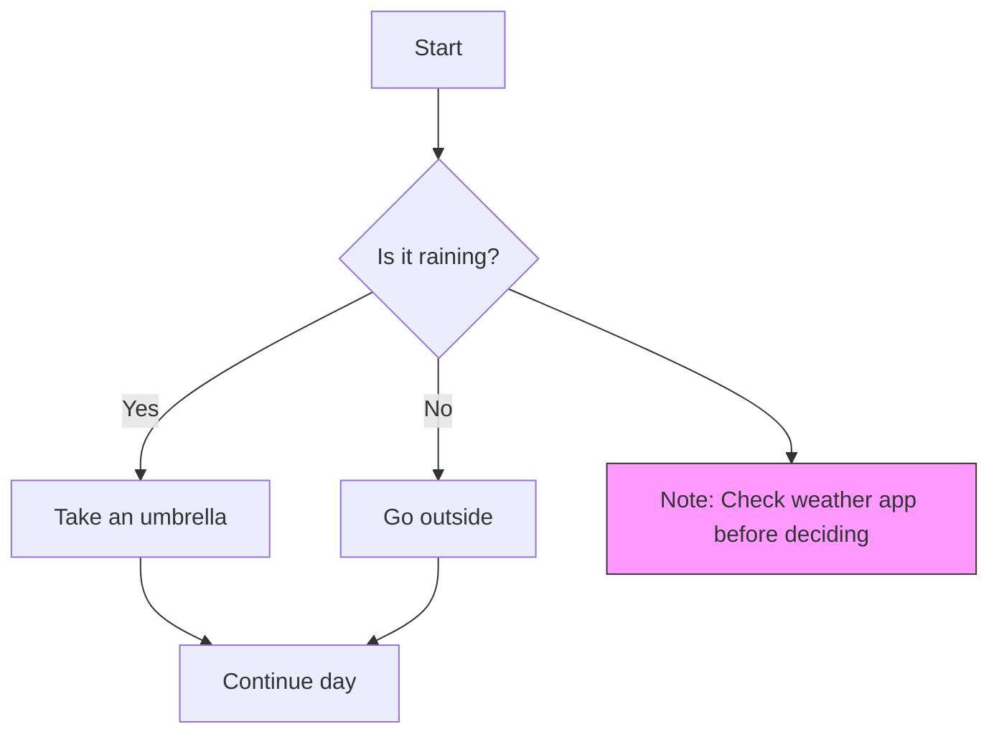
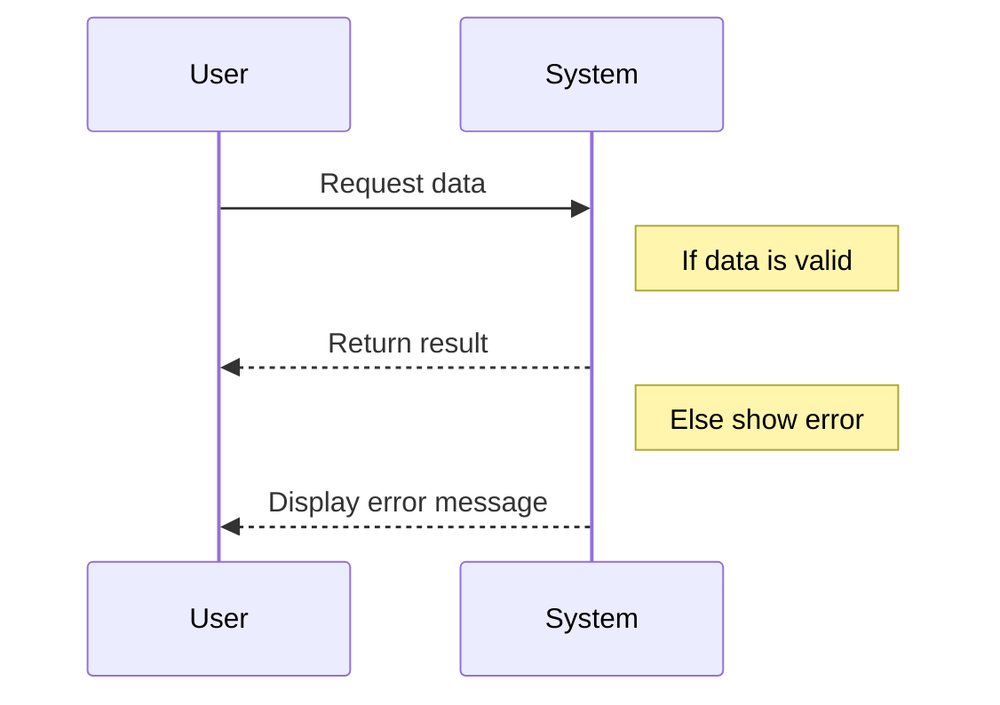

## 🏭 End of Day Process Flow

This document outlines the steps taken by the system at the end of each business day to ensure inventory levels are accurate, replenishment is triggered when necessary, automates all daily closing operations, ensuring backups, data integrity, reporting, and notifications are handled consistently and reliably.

---

## 📚 KMDS D1 Menu (`Form_EndOfDay.Form_Open`)

- **Initial Setup**
    - Creates an ADODB recordset to read from the `qryCashRegisters` query.
        ```sql
        SELECT CashSys.ID, CashSys.ComputerName, CashSys.Description, Sysfile.Cr1Installed, Sysfile.Cr2Installed, Sysfile.Cr3Installed, Sysfile.Cr4Installed, Sysfile.Cr5Installed, Sysfile.Cr1CheckOut, Sysfile.Cr2CheckOut, Sysfile.Cr3CheckOut, Sysfile.Cr4CheckOut, Sysfile.Cr5CheckOut
        FROM CashSys, Sysfile
        ORDER BY CashSys.ID;
        ```
- **Register Check**
  - Loops through registers 1 to 5.
  - Checks if any register is checked out (Cr1CheckOut, Cr2CheckOut, etc.).
  - Sets `bAtLeastOneRegisterCheckedOut` to True if any are checked out.
    ```vb
    Select Case !ID
        Case 1
        If !Cr1CheckOut = True Then bAtLeastOneRegisterCheckedOut = True
    ```
- **End of Day Trigger**
  - If at least one register is checked out:
    ```vb
    If bAtLeastOneRegisterCheckedOut Then
    ```
    - Calls **`EndOFDayStream`** (starts the end of day process).
    - Runs a logout batch file (`kmdslogout.bat`).
        ```vb
        Shell "c:\kmds\kmdslogout.bat", vbNormalFocus
        ```
    - Quits Access (`DoCmd.Quit`).



---

## 🌉 EndOFDayStream (`modEOD.EndOFDayStream`) {#EndOFDayStream}
```vb
Public Function EndOFDayStream()
```

#### 1. Logging and Setup (`modEOD.EOLog`) 📝 {#EOLog}
  - Builds a folder path for the log file using `gstrMailDir` and the current date (year/month/day).
    ```vb
    If gstrMailDir = "" Then LoadDefaults
    ...
    modKMDS.LoadDefaults
    rstemp.Open "SysFile", CurrentProject.Connection, adOpenKeyset, adLockOptimistic
    gstrMailDir = !NetworkMailDir   '\\FS1\KMDS\
    ```
  - Opens (or creates) the log file `EOLog.Txt` in append mode.
    ```vb
    \\FS1\KMDS\Log\2025\08\01\EOLog.Txt
    ```
  - Logs the start of the process.
    ```vb
    EOLog "========================================================="
    EOLog "End of Day - Start"
    EOLog "========================================================="
    ```

### 2. Load Defaults ⚙️
  - Ensures key global variables (`gstrMailDir`, `gstrNetworkDatabase`) are set, loading defaults if needed.
    The **`modKMDS.LoadDefaults`** function initializes global variables and system settings for the application.
    ```vb
    rstemp.Open "SysFile", CurrentProject.Connection, adOpenKeyset, adLockOptimistic 
    gstrMailDir = !NetworkMailDir
    gstrNetworkDatabase = !NetworkDatabase
    ```
  - Logs the mail directory and network database paths.
    ```vb
    EOLog "gstrMailDir = " & gstrMailDir    '\\FS1\KMDS\
    EOLog "gstrNetworkDatabase = " & gstrNetworkDatabase    'C:\KMDS\KMDS2007.ACCDR
    ```
      
### 3. Prepare Backup Directory 📁
  - Builds a backup folder path for today (year/month/day).
    ```vb
    strTargetPath = gstrMailDir & "Backup\"
    ...
    EOLog "Creating Folder : " & strTargetPath  '\\FS1\KMDS\Backup\2025\08\01
    ```
### 4. Check Cash Register Files 🧾
  - Verifies that all required cash register files (`CR1.MDB` to `CR5.MDB`) exist.
  - Logs and shows errors if any are missing, then exits.
    ```vb
    If Not fso.FileExists(gstrMailDir & "Mail\CR1.MDB") Then
        EOLog "ERROR " & gstrMailDir & "Mail\CR1.MDB not found"
        MsgBox gstrMailDir & "Mail\CR1.MDB not found", vbCritical, "EndOfDay"
        gbEOProcessError = True
        GoTo ExitSub
    End If
    ...
    If Not fso.FileExists(gstrMailDir & "Mail\CR5.MDB") Then
        EOLog "ERROR " & gstrMailDir & "Mail\CR5.MDB not found"
        MsgBox gstrMailDir & "Mail\CR4.MDB not found", vbCritical, "EndOfDay"
        gbEOProcessError = True
        GoTo ExitSub
    End If
    ```
### 5. Database Backup 🗃️
  - Calls **`modDumpTable.MakeSQLBackup`** to back up SQL tables. 
    ```vb
    EOLog "Dumping SQL Tables"
    'DumpSQLTables -->> this is commented out
    --------------------------------
    EOLog "MakeSQLBackup"
    MakeSQLBackup
    ```
    ```vb
    modDumpTable.MakeSQLBackup
    -----------------------------
    .CommandText = "Select CashsysInsLoc from Sysfile"
    ...
    strPassString = "c:\kmds\kmdsDUMP.bat " & rstemp!CashsysInsLoc & " " & Format(Now, "yyyy-dd-mm$hh-nn")
    ```
  - Runs a batch file (`kmdsDUMP.bat`) to create a backup of the SQL database, passing the cash register installation location and a timestamp as parameters.
    ```vb
    C:\KMDS\kmdsDUMP.bat
    -----------------------------
    *** DOCUMENT THE SCRIPT HERE ***
    ```
### 6. Cleanup/Reset 🧹
  - Deletes old transmit list and LastNiteFiles batch file.
    ```vb
    EOLog "Delete : C:\kmds\EOD File Transmit List.txt"
    fso.DeleteFile "C:\kmds\EOD File Transmit List.txt", True
    ...
    EOLog "Delete : K:LastNiteFiles.BAT"
    fso.DeleteFile "K:LastNiteFiles.BAT", True
    ```
    ```vb
    K:LastNiteFiles.BAT
    -----------------------------
    *** DOCUMENT THE SCRIPT HERE ***
    ```
  - Retrieve DaysToRetain in Settings and add if missing.
    *KMDS2007 uses table `Settings` to store matched pairs in a Key/Value schema. If the keyname cannot be found then a new Key/Value is setup. The table can be accessed through the g-5 screen under `Settings` tab.*

    ```vb
    GetKMDSSettings "DaysToRetain", "500"
    ```
    ```vb
    modAcc2007.GetKMDSSettings
    -----------------------------
    With rstemp
    ...
    .Open "Settings", CurrentProject.Connection, , , adCmdTable
    ...
    If .EOF Then
        .AddNew
        !KeyName = KeyName
        !Value = DefaultValue
        .Update
        GetKMDSSettings = DefaultValue
    Else
        If Not IsNull(!Value) Then GetKMDSSettings = !Value
    ```

### 7. Process End-of-Day Queries and Reports 📊
  - Runs queries and reports defined for day-end using `modEOD.EOProcess`.
    ```vb
    If EOProcess("qryEOD", "DayEnd") = True Then
    ```
    - Build Query List - *Constructs a SQL statement to select all objects from `MSysObjects` whose names start with the given `QuerySequencePrefix` (e.g., `qryEOD`). Orders them by name.*
        ```vb
        modEOD.EOProcess
        -----------------------------
        Public Function EOProcess(QuerySequencePrefix As String, ShareName As String) As Boolean
        ...
        strSQL = "SELECT MSysObjects.Name, "
        strSQL = strSQL & "MSysObjects.Type "
        strSQL = strSQL & "FROM MSysObjects "
        strSQL = strSQL & "WHERE (((MSysObjects.Name) Like '" & QuerySequencePrefix & "%')) "
        strSQL = strSQL & "ORDER BY MSysObjects.Name"
        ...
        .CommandText = strSQL   'SELECT Name, Type FROM MSysObjects WHERE Name Like 'qryEOD*' ORDER BY Type, Name
        ...
        Set rstemp = comQDF.Execute
        ```
      Extracted queries and reports from `MSysObjects` ordered by name. This is the order in `EOLog.txt` file.
        ```sql
        *** R *** qryEOD001InventoryValueBegin
        *** Q *** qryEOD010DeleteInvoHead5.sql
        *** Q *** qryEOD011DeleteInvoLine5.sql
        *** Q *** qryEOD021AppendCR1InvoLine.sql
        *** Q *** qryEOD023AppendCR2InvoLine.sql
        *** Q *** qryEOD025AppendCR3InvoLine.sql
        *** Q *** qryEOD027AppendCR4InvoLine.sql
        *** Q *** qryEOD027AppendCR5InvoLine.sql
        *** Q *** qryEOD028UpdateInvo5LineCost.sql
        *** Q *** qryEOD029UpdateInvo5LineCostByDptGP.sql
        *** Q *** qryEOD029UpdateInvo5LineCostLiquorClub.sql
        *** Q *** qryEOD029UpdateInvo5LineCostLiquorClubDiscount.sql
        *** Q *** qryEOD029UpdateInvo5LineCostLiquorCounter.sql
        *** Q *** qryEOD029UpdateInvo5LineCostTransfersToZero.sql
        *** Q *** qryEOD030CashierAutodropCharges.sql
        *** Q *** qryEOD030CashierAutodropChargesReverse.sql
        *** Q *** qryEOD031CashierAutodropChecks.sql
        *** Q *** qryEOD031CashierAutodropChecksReverse.sql
        *** Q *** qryEOD033BottleDepositQtyAdjAtEOD.sql
        *** R *** qryEOD040SalesByDepartment
        *** R *** qryEOD040SalesByTenderByRegister
        *** R *** qryEOD041ChecksTenderedByCashier
        *** R *** qryEOD042ChargesTenderedByCashier
        *** R *** qryEOD043CashDropsAndLoans
        *** R *** qryEOD050SalesByAllCashiersByDepartment
        *** R *** qryEOD051CashiersProductivity
        *** R *** qryEOD052SalesReturnsByCashier
        *** R *** qryEOD053CancelledSalesByCashier
        *** R *** qryEOD054ReturnsCancelledSalesByCashier
        *** R *** qryEOD060ClubInvoices
        *** Q *** qryEOD065ClubInvoicesDelete.sql
        *** Q *** qryEOD100DeleteItemsSold.sql
        *** Q *** qryEOD101AppendItemsSold.sql
        *** Q *** qryEOD102UpdateItemsOnhand.sql
        *** Q *** qryEOD103AppendShifts.sql
        *** Q *** qryEOD104AppendInvo5Line.sql
        *** R *** qryEOD120RItemsSoldToday
        *** R *** qryEOD121RItemsSetupToday
        *** R *** qryEOD122RItemsWithNegativeOnhands
        *** R *** qryEOD123ROnhandChangesToday
        *** R *** qryEOD124ROpenAccounts
        *** R *** qryEOD125SalesByDepartmentByTender
        *** R *** qryEOD126ItemRestockList
        *** R *** qryEOD126ItemRestockListNOSubtotals
        *** R *** qryEOD127RFintech
        *** R *** qryEOD128RLiquorItemsNotScanned
        *** R *** qryEOD129RInvoicesWithCoupons
        *** R *** qryEOD200InventoryValueEnd
        *** Q *** qryEOD900ItemZeroSoldToday.sql
        *** Q *** qryEOD901SetSysfileCheckFlagTo0.sql
        *** Q *** qryEOD902DeleteItemsSold.sql
        *** Q *** qryEOD910CashierDropCountReset.sql
        *** Q *** qryEOD921PurgeInvoline_1_Mark_With_Z.sql
        *** Q *** qryEOD921PurgeInvoline_2_Delete_With_Z.sql
        *** Q *** qryEOD921PurgeKMDSLog500Days.sql
        *** Q *** qryEOD922SetItemSubCategoryIDTo0.sql
        ```
    - Execute Each Object - *Loops through each object found.*
        ```vb
        With rstemp
            Do While Not .EOF
        ```
      - Logs the object name and type.
        ```vb
        EOLog !Name & " " & !Type
        ```
      - If the object type is 5 (query), calls `QueryExecute` to run it.
        ```vb
        Select Case !Type
        Case 5 
            QueryExecute !Name
        ```
        ```vb
        modEOD.QueryExecute
        ------------------------------
        Public Sub QueryExecute(QueryName As String)
        ...
        With comQDF
        ...
            .CommandText = QueryName
            .Execute
        ```
      - If the object type is -32764 (report), calls `ReportExecute` to run and process the report.
        ```vb
        Case -32764
            ReportExecute !Name, ShareName
        ```
        - Opens the `EOReport` table to find the record for the given `ReportName`.
            ```vb
            modEOD.ReportExecute
            ------------------------------
            Public Sub ReportExecute(ReportName As String, ShareName As String)
            ...
            With rstemp
            ...
                .Open "EOReport", CurrentProject.Connection, , , adCmdTable
            ...
            rstemp.Find "ReportName='" & ReportName & "'"
            ```
        - If the report is not found:
          - Logs the setup of a new report name.
          - Adds a new record with `NumberOfCopies` set to 0.
        - Retrieves `NumberOfCopies` and `EMail` flag for the report.
            ```vb
            If rstemp.EOF Then
                EOLog "Setting up new reportname : " & ReportName
                rstemp.AddNew
                rstemp!ReportName = ReportName 
                rstemp!NumberOfCopies = 0
                rstemp.Update
                nNumberOfCopies = 0
            Else
                nNumberOfCopies = rstemp!NumberOfCopies
            End If
            beMail = rstemp!EMail
            ```
        - Opens the report in preview mode (`acViewPreview`).
            ```vb
            DoCmd.OpenReport ReportName, acViewPreview
            ```
        - Calls `ArchiveReportShare` to output the report (`.pdf` or `.snp`) and assign the filename to `strEmailFileName`.
            ```vb
            strEmailFileName = ArchiveReportShare(ReportName, ShareName)
            ```
            ```vb
            modKMDS.ArchiveReportShare
            --------------------------------
            Public Function ArchiveReportShare(ReportName As String, Optional ReportDescription As String) As String
            ...
            'Create the directory for today e.g. "'\\FS1\KMDS\EndOfDay\2025\08\01"
            fldr = gstrReportsDir   'global variable set in modKMDS.LoadDefaults
            ...
            fldr = fldr & "EndOfDay" & "\"
            ...
            If gbSaveReportsAsPDF Then
                fldr = fldr & ".pdf"
                ArchiveReportShare = fldr
                DoCmd.OutputTo acOutputReport, ReportName, acFormatPDF, fldr
            Else
                fldr = fldr & ".snp"
                ArchiveReportShare = fldr
                DoCmd.OutputTo acOutputReport, ReportName, acFormatSNP, fldr
            End If
            ```
        - If `NumberOfCopies` > 0, prints the specified number of copies.
        - If `ShareName` is "DayEnd", appends the archived filename to `K:LastNiteFiles.Bat` for batch processing.
            ```vb
            If nNumberOfCopies > 0 Then
                DoCmd.PrintOut acPrintAll, , , , nNumberOfCopies
                ...
                If ShareName = "DayEnd" Then
                    Set ts = fsoTemp.OpenTextFile("K:LastNiteFiles.Bat", ForAppending, True, TristateMixed)
                    ts.WriteLine Chr(34) & strEmailFileName & Chr(34)
            ```
        - Closes the report after printing.
        - If the `beMail` flag is set, appends the archived filename to `C:\kmds\EOD File Transmit List.txt` for later email transmission.
            ```vb
            If beMail Then
                Set ts = fsoTemp.OpenTextFile("C:\kmds\EOD File Transmit List.txt", ForAppending, True, TristateMixed)
                ts.WriteLine strEmailFileName
            ```
        - If FTP is active (`gbKMDSFTPActive`) and the report is `qryEOD040SalesByDepartment`, copies the archived file to a specific FTP output directory, choosing .pdf or .snp extension based on settings.
            ```vb
            If gbKMDSFTPActive Then 'send files to ftp.kmds.us
                If ReportName = "qryEOD040SalesByDepartment" Then
                ...
                strt = "K:\Mail\KMDSFTP\OUT\ADS " & glnAgentNumber & " " & Format(Now, "yyyy-mm-dd hh-nn-ss")
                If gbSaveReportsAsPDF Then
                    strt = strt & ".pdf"
                Else
                    strt = strt & ".snp"
                End If
                fsoTemp.CopyFile strEmailFileName, strt, True
            ```
        - Handles errors gracefully
            ```vb
            Select Case Err.Number
            Case 2501 ' cancel error (No data)
                EOLog "  NO DATA TO REPORT!"
            Case Else
                EOLog "Error #" & Err.Number & " " & Err.Description & " : ReportExecute : " & ReportName
                ...
            ```
      - If the object is not a query or report, logs an error and sets the error flag.
        ```vb
        MsgBox "Unknown qryEOD type: " & !Type & " for " & !Name
        ...
        ErrLog:
            EOProcess = False
            EOLog strSQL & vbCrLf & "Error #" & Err.Number & " " & Err.Description & " : EOProcess"
        ```
  - If `modEOD.EOProcess` is successful, move cash register files to the backup folder with a timestamp (`CR1.MDB` to `CR5.MDB`).
    ```vb
    If EOProcess("qryEOD", "DayEnd") = True Then
    ...
    'strTargetPath is the backup folder created in step 3
    '\\FS1\KMDS\Backup\2025\08\01
    ...
    EOLog "Moving :" & gstrMailDir & "Mail\CR1.MDB to " & strTargetPath
    fso.MoveFile gstrMailDir & "Mail\CR1.MDB", strTargetPath & "CR1" & Format(Now, "yyyy-mm-dd hh-nn-ss") & ".mdb"
    ...
    EOLog "Moving :" & gstrMailDir & "Mail\CR5.MDB to " & strTargetPath
    fso.MoveFile gstrMailDir & "Mail\CR5.MDB", strTargetPath & "CR5" & Format(Now, "yyyy-mm-dd hh-nn-ss") & ".mdb"
    ```
    <br>

### 8. Export Fintech Data ↗️
  - Retrieve `Fintech.Active` in `Settings` and run the export if it's active.
    ```vb
    If GetKMDSSettings("Fintech.Active", "False") = "True" Then
            EOLog "Fintech.Active = True"
            FinTechExport
            EOLog "Fintech.Active Finished"        
        Else
            EOLog "Fintech = False"
    ```
  - Export FinTect data
      - Ensures the following folders exist, creating them if necessary:
        ```vb
        k:\mail\FinTech\Out
        k:\mail\FinTech\Out\Archive
        k:\mail\FinTech\In
        k:\mail\FinTech\In\Archive
        ```
      - Builds a filename for the CSV export using the current date and time.
        ```vb
        Public Sub FinTechExport()
        ...
        'Creating the folders
        ...
        strDirName = "k:\mail\FinTech\Out"
        strFileName = strDirName & "\FT" & Year(Now) & "-" & Month(Now) & "-" & Day(Now) & " " & Hour(Now) & "-" & Minute(Now) & ".csv"
        'k:\mail\FinTech\Out\FT2025-8-1 10-33.csv
        ```
      - Export the results of the `qryFintechExport` query to the CSV file.
        ```vb
        DoCmd.TransferText acExportDelim, , "qryFintechExport", strFileName, True
        ```
        ```sql
        *** qryFintechExport
        SELECT qryFintechDivisionID.Division_ID, qryFintechTransactionClubID.Invoice_Number, Format([qryFintechTransactionClubID].[SetupDate],"mm/dd/yyyy") AS invoice_date, qryFintechTransactionClubID.Licensee AS Vendor_store_id, InvoLine5.Quantity AS quantity_shipped, "EA" AS Quantity_uom, CStr([Item].[id]) AS item_number, IIf(([involine5].[TransType]="C"),[item].[Description],"Discount") AS product_description, [involine5].[price]/[involine5].[quantity] AS unit_price
        FROM Sysfile, qryFintechDivisionID, ((qryFinTechTransactions 
        INNER JOIN qryFintechTransactionClubID ON (qryFinTechTransactions.SetupDate = qryFintechTransactionClubID.SetupDate) AND (qryFinTechTransactions.CashSysID = qryFintechTransactionClubID.CashSysID) AND (qryFinTechTransactions.InvoHeadID = qryFintechTransactionClubID.InvoHeadID)) 
        INNER JOIN InvoLine5 ON (qryFinTechTransactions.SetupDate = InvoLine5.SetupDate) AND (qryFinTechTransactions.CashSysID = InvoLine5.CashSysID) AND (qryFinTechTransactions.InvoHeadID = InvoLine5.InvoHeadID)) 
        INNER JOIN Item ON InvoLine5.Code = Item.ID 
        WHERE (((InvoLine5.TransType)="C" Or (InvoLine5.TransType)="D"));
        ```
      - Retrieves FTP credentials (`URL`, `UserName`, `Password`) from settings using `GetKMDSSettings`.
        ```vb
        strFintechURL = GetKMDSSettings("Fintech.URL", "ftp.kmds.us")
        strFintechUserName = GetKMDSSettings("Fintech.UserName", "Agents")
        strFintechPassword = GetKMDSSettings("Fintech.Password", "Ag3nt$")
        ```
      - Constructs a script string for the FTP utility (`kmdsftp.exe`), including: FTP server URL, Username and Password.
        ```vb
        'build logon string used by kmdsftp
        strFinTechLogon = strFintechURL & vbCrLf
        strFinTechLogon = strFinTechLogon & strFintechUserName & vbCrLf
        strFinTechLogon = strFinTechLogon & strFintechPassword & vbCrLf
        ```
      - An MPUT command to upload files matching FT2*.csv from the output directory, with flags for ASCII/binary and archiving.
        ```vb
        'add MPUT command as 4th line of string (note 1 at the end will move put file to archive directory
        strFinTechLogon = strFinTechLogon & "MPUT" & vbTab & strDirName & vbTab & "FT2*.csv" & vbTab & IIf(gbOLCCFTPAscii, 1, 0) & vbTab & 1
        ```
      - Writes this script to `k:\mail\FinTech\Out\FinTechPut.txt`.
        ```vb
        Set txtstrTemp = fsoTemp.OpenTextFile(strDirName & "\FinTechPut.txt", ForWriting, True, TristateFalse)
        txtstrTemp.WriteLine strFinTechLogon
        ```
      - FTP Upload - calls `WaitForExecCmd` to run the FTP utility with the script file, triggering the upload.
        ```vb
        WaitForExecCmd "\\" & gstrCashsysInsLoc & "\kmds\kmdsftp.exe " & strDirName & "\FinTechPut.txt" ', vbNormalFocus
        ```
<br>

### 9. Creates daily transmit files.🗄️
  - This process automates the creation and preparation of daily inventory and sales transmission files for OLCC (Oregon Liquor Control Commission) reporting. It also generates FTP script files for batch transmission.
    ```vb
    EOLog "Create Daily Transmit files"
    OLCCCreateDailyTransmitFiles
    ```
  - Check and create the folders if they do not exist. Also, set the global variables.
    ```vb
    modOLCTransmit.OLCCCreateDailyTransmitFiles
    --------------------------------------------
    Public Sub OLCCCreateDailyTransmitFiles()
    ...
    If glnAgentNumber = 0 Then LoadDefaults
    ...
    'Create the folders
    If Not fsoTemp.FolderExists("\\" & gstrCashsysInsLoc & "\KMDS\MAIL...
        fsoTemp.CreateFolder ("\\" & gstrCashsysInsLoc & "\KMDS\MAIL...
        
        'gstrCashsysInsLoc variable is set in modKMDS.LoadDefaults
        \\gstrCashsysInsLoc\KMDS\MAIL       
        \\gstrCashsysInsLoc\KMDS\MAIL\OUT
        k:\mail\Out\Log
    ```
  - Create two FTP script files:
      - Sales files (`FTPSales.txt`)
        ```vb
        Set txtstrTemp = fsoTemp.OpenTextFile("\\" & gstrCashsysInsLoc & "\KMDS\MAIL\OUT\FTPSales.txt", ForWriting, True, TristateFalse)
        strTemp = gstrFTPLogon
        strTemp = strTemp & "MPUT" & vbTab & "\\" & gstrCashsysInsLoc & "\KMDS\MAIL\OUT\" & vbTab & "Sales*.txt" & vbTab & IIf(gbOLCCFTPAscii, 1, 0) & vbTab & 1
        txtstrTemp.WriteLine strTemp
        ```
      - Daily inventory files (`FTPDailyInv.txt`)
        ```vb
        Set txtstrTemp = fsoTemp.OpenTextFile("\\" & gstrCashsysInsLoc & "\KMDS\MAIL\OUT\FTPDailyInv.txt", ForWriting, True, TristateFalse)
        strTemp = gstrFTPLogon
        strTemp = strTemp & "MPUT" & vbTab & "\\" & gstrCashsysInsLoc & "\KMDS\MAIL\OUT\" & vbTab & "DailyInv*.txt" & vbTab & IIf(gbOLCCFTPAscii, 1, 0) & vbTab & 1
        txtstrTemp.WriteLine strTemp
        ```
      - Each script contains:
          - FTP logon information (`gstrFTPLogon`)
          - An `MPUT` command to upload all matching files (`Sales*.txt` or `DailyInv*.txt`) from the output directory.
          - Flags for ASCII/binary transfer and archiving.
      - Generate a WinSCP script for secure FTP transmission.
        ```vb
        'added for 31415
        CreateWinSCPtoKMDSFTPScriptFile
        ```
          - The function first checks if `gbKMDSFTPActive` is True. If not, it exits immediately.
            ```vb
            'added for 31415
            modWinSCP.CreateWinSCPtoKMDSFTPScriptFile
            --------------------------------------------
            Public Sub CreateWinSCPtoKMDSFTPScriptFile()
            ...
            If Not gbKMDSFTPActive Then 'jump out if not active - G-5 -> Settings -> KMDSFTPActive
                Exit Sub
            ```
          - Verify and create (if missing) the folders.
            ```vb
            If Not fsoTemp.FolderExists("\\" & gstrCashsysInsLoc & "\KMDS\MAIL...
                fsoTemp.CreateFolder ("\\" & gstrCashsysInsLoc & "\KMDS\MAIL...

                'gstrCashsysInsLoc variable is set in modKMDS.
                \\gstrCashsysInsLoc\KMDS\MAIL             
                \\gstrCashsysInsLoc\KMDS\MAIL\KMDSFTP
                \\gstrCashsysInsLoc\KMDS\MAIL\KMDSFTP\OUT
                \\gstrCashsysInsLoc\KMDS\MAIL\KMDSFTP\OUT\Archive
                \\gstrCashsysInsLoc\KMDS\MAIL\KMDSFTP\OUT\Log
            ```
          - Create WinSCP script file.
            ```vb
            strTargetFile = "k:\MAIL\KMDSFTP\OUT\WinSCPFTPTransmitKMDS.TXT"
            Set txtstrTemp = fsoTemp.OpenTextFile(strTargetFile, ForWriting, True, TristateFalse)
            With txtstrTemp
                .WriteLine ...
            ```
          - Create `c:\npos\WinSCPKS.TXT` and `c:\npos\WinSCPKS.bat` to download a file (`KMDSSW.txt`) from the FTP server for subscription verification.
            ```vb
            strTargetFile = "c:\npos\WinSCPKS.TXT"
            Set txtstrTemp = fsoTemp.OpenTextFile(strTargetFile, ForWriting, True, TristateFalse)
            With txtstrTemp
                .WriteLine
            ...
            strTargetFile = "c:\npos\WinSCPKS.bat"
            Set txtstrTemp = fsoTemp.OpenTextFile(strTargetFile, ForWriting, True, TristateFalse)
            With txtstrTemp
                .WriteLine
            ```
    - Calls the following routines to generate the actual data files:
        ```vb
        OLCCDailyInventFile CLng(glnAgentNumber), False
        OLCCDailyInventFile CLng(glnAgentNumber), True
        OLCCDailySalesFile CLng(glnAgentNumber), False
        OLCCDailySalesFile CLng(glnAgentNumber), True
        ```
        - **`OLCCDailyInventFile`** (for daily inventory, both non-archived and archived)
            - If the agent number is greater than 1000, subtracts 1000 (likely to normalize the agent number).
                ```vb
                modOLCTransmit.OLCCDailyInventFile
                ----------------------------------------
                Public Sub OLCCDailyInventFile(nAgentNumber As Long, Archive As Boolean)
                ...
                If nAgentNumber > 1000 Then nAgentNumber = nAgentNumber - 1000
                ```
            - Verify and create (if missing) the folders.
            ```vb
            If Not fsoTemp.FolderExists(...) Then
                fsoTemp.CreateFolder (...)

                'gstrCashsysInsLoc variable is set in modKMDS.
                \\gstrCashsysInsLoc\KMDS\MAIL
                \\gstrCashsysInsLoc\KMDS\MAIL\OUT
                k:\mail\Out\Log
                \\gstrCashsysInsLoc\KMDS\MAIL\OUT\ARCHIVE
            ```
            - If Archive is `True`: Creates an archive file in ARCHIVE folder and prepares a second file for FTP transmission.
            - If Archive is `False`: Creates a daily inventory file in the OUT folder.
                ```vb
                If Archive Then 
                    mstrFileNameArchive = "\\" & gstrCashsysInsLoc & "\KMDS\MAIL\OUT\ARCHIVE\DailyInv " & mstrNow & ".txt"
                    mstrFileNameKMDSFTP = "\\" & gstrCashsysInsLoc & "\KMDS\MAIL\KMDSFTP\OUT\DailyInventory " & mstrNow & ".txt"
                    Set txtstrTemp = fsoTemp.OpenTextFile(mstrFileNameArchive, ForWriting, True, TristateFalse) 

                Else
                    Set txtstrTemp = fsoTemp.OpenTextFile("\\" & gstrCashsysInsLoc & "\KMDS\MAIL\OUT\DailyInv" & Left(mstrNow, 6) & ".txt", ForWriting, True, TristateFalse)
                End If
                ```
            - Opens the file and writes two header lines to the file using `Build21Header` and `Build63Header` functions, which format the header according to OLCC requirements.
                ```vb
                mstrNow = Format(Now, "yymmddhhnn")
                ...
                nAgentNumber = nAgentNumber + 1000
                txtstrTemp.WriteLine (Build21Header(nAgentNumber, mstrNow))
                txtstrTemp.WriteLine (Build63Header(nAgentNumber, mstrNow))
                ```
            - Executes the `qryCreateTransmitInventory` query to get inventory data.
                ```vb
                With comQDF
                    .ActiveConnection = CurrentProject.Connection
                    .CommandText = "qryCreateTransmitInventory"
                    Set rstemp = .Execute
                ```
                ```sql
                *** qryCreateTransmitInventory
                SELECT Format([ID],"00000000000") AS ID, Item.Onhand
                FROM Item
                WHERE (((Item.Onhand)>0) AND ((Item.SalesDepartmentID)=1));
                ```
            - For each record, increments the line count. Writes a formatted inventory line using `BuildDailyInvLine`, which includes agent number, item ID, quantity, and date.
                ```vb
                With rstemp
                    If rstemp.RecordCount = 0 Then
                    MsgBox "No Records found for Sales department 1"
                    GoTo ExitSub
                ...
                Do While Not .EOF
                    nLineCount = nLineCount + 1 
                    txtstrTemp.WriteLine BuildDailyInvLine(nAgentNumber, !ID, !Onhand, mstrNow)
                    .MoveNext
                ```
                ```vb
                modOLCTransmit.BuildDailyInvLine
                ---------------------------------
                Public Function BuildDailyInvLine(AgentNumber As Long, ItemID As Double, Quantity As Integer, mstrNow As String) As String
                    BuildDailyInvLine = "63" & mstrNow & Format(CStr(AgentNumber), "0000")
                    BuildDailyInvLine = BuildDailyInvLine & Format(CStr(ItemID), "00000000000")
                    BuildDailyInvLine = BuildDailyInvLine & Format(CStr(Quantity), "00000")
                    BuildDailyInvLine = BuildDailyInvLine & Left(mstrNow, 6)
                End Function
                ```
              - After all records are processed, writes two trailer lines using Build63Trailer and Build21Trailer to mark the end of the file.
                ```vb
                txtstrTemp.WriteLine (Build63Trailer(nAgentNumber, nLineCount, mstrNow))
                txtstrTemp.WriteLine (Build21Trailer(nAgentNumber, nLineCount, mstrNow))
                ```
            - If Archive is True and FTP is active, copies the archive file to the FTP output folder for transmission.
                ```vb
                If Archive Then
                    If gbKMDSFTPActive Then fsoTemp.CopyFile mstrFileNameArchive, mstrFileNameKMDSFTP
                ```
        - **`OLCCDailySalesFile`** (for daily sales, both non-archived and archived)
            - If the agent number is greater than 1000, subtracts 1000 (likely to normalize the agent number).
                ```vb
                modOLCTransmit.OLCCDailySalesFile
                ----------------------------------------
                Public Function OLCCDailySalesFile(nAgentNumber As Long, Archive As Boolean)
                ...
                If nAgentNumber > 1000 Then nAgentNumber = nAgentNumber - 1000
                ```
            - Verify and create (if missing) the folders.
            ```vb
            If Not fsoTemp.FolderExists(...) Then
                fsoTemp.CreateFolder (...)

                'gstrCashsysInsLoc variable is set in modKMDS.
                \\gstrCashsysInsLoc\KMDS\MAIL
                \\gstrCashsysInsLoc\KMDS\MAIL\OUT
                k:\mail\Out\Log
                \\gstrCashsysInsLoc\KMDS\MAIL\OUT\ARCHIVE
            ```
            - If Archive is `True`: Creates an archive file in ARCHIVE folder and prepares a second file for FTP transmission.
            - If Archive is `False`: Creates a daily inventory file in the OUT folder.
                ```vb
                If Archive Then 
                    mstrFileNameArchive = "\\" & gstrCashsysInsLoc & "\KMDS\MAIL\OUT\ARCHIVE\Sales " & mstrNow & ".txt"
                    mstrFileNameKMDSFTP = "\\" & gstrCashsysInsLoc & "\KMDS\MAIL\KMDSFTP\OUT\DailySales " & mstrNow & ".txt"
                    Set txtstrTemp = fsoTemp.OpenTextFile(mstrFileNameArchive, ForWriting, True, TristateFalse) 
                Else
                    Set txtstrTemp = fsoTemp.OpenTextFile("\\" & gstrCashsysInsLoc & "\KMDS\MAIL\OUT\Sales" & Left(mstrNow, 6) & ".txt", ForWriting, True, TristateFalse)
                End If
                ```
            - Opens the file and writes two header lines to the file using `Build21Header` and `Build63Header` functions, which format the header according to OLCC requirements.
                ```vb
                mstrNow = Format(Now, "yymmddhhnn")
                ...
                nAgentNumber = nAgentNumber + 1000
                txtstrTemp.WriteLine (Build21Header(nAgentNumber, mstrNow))
                txtstrTemp.WriteLine (Build63Header(nAgentNumber, mstrNow))
                ```
            - Executes the `qryCreateTransmitDailySales` query to get inventory data.
                ```vb
                With comQDF
                    .ActiveConnection = CurrentProject.Connection
                    .CommandText = "qryCreateTransmitDailySales"
                    Set rstemp = .Execute
                ```
                ```sql
                *** qryCreateTransmitDailySales
                SELECT InvoLine5.CashSysID, Format(First(((InvoLine5.InvoHeadID*100)+[ID])),"000000000") AS TransactionNumber, Format(Now(),'yymmdd') AS CreateDate, Format(Now(),'hhnn') AS CreateTime, Format([Code],"00000000000") AS OLCCItemCode, Format(Sum([quantity]),"00000;-0000") AS OLCCQuantity, Format(InvoLine5.SetupDate,'yymmdd') AS RegisterDate, Format(InvoLine5.SetupDate,'hhnnss') AS RegisterTime, Format(IIf(IsNumeric([InputCode]),[InputCode],[Code]),"!@@@@@@@@@@@@@@") AS UPCCode, Format(((InvoLine5.Price/[quantity])*100),"0000000") AS SellingPrice, qryCreateTransmitDailySalesInvoiceNo.LicenseeInvoiceNumber AS LIN, qryCreateTransmitDailySalesInvoiceNo.PremisesNumber AS PN, qryCreateTransmitDailySalesInvoiceNo.Discount, qryCreateTransmitDailySalesTenderCode.TenderCode
                FROM (InvoLine5 
                LEFT JOIN qryCreateTransmitDailySalesInvoiceNo ON (InvoLine5.InvoHeadID = qryCreateTransmitDailySalesInvoiceNo.InvoHeadID) AND (InvoLine5.CashSysID = qryCreateTransmitDailySalesInvoiceNo.CashSysID) AND (InvoLine5.SetupDate = qryCreateTransmitDailySalesInvoiceNo.SetupDate)) 
                INNER JOIN qryCreateTransmitDailySalesTenderCode ON (InvoLine5.SetupDate = qryCreateTransmitDailySalesTenderCode.SetupDate) AND (InvoLine5.CashSysID = qryCreateTransmitDailySalesTenderCode.CashSysID) AND (InvoLine5.InvoHeadID = qryCreateTransmitDailySalesTenderCode.InvoHeadID)
                GROUP BY InvoLine5.CashSysID, Format(Now(),'yymmdd'), Format(Now(),'hhnn'), Format([Code],"00000000000"), Format(InvoLine5.SetupDate,'yymmdd'), Format(InvoLine5.SetupDate,'hhnnss'), Format(IIf(IsNumeric([InputCode]),[InputCode],[Code]),"!@@@@@@@@@@@@@@"), Format(((InvoLine5.Price/[quantity])*100),"0000000"), qryCreateTransmitDailySalesInvoiceNo.LicenseeInvoiceNumber, qryCreateTransmitDailySalesInvoiceNo.PremisesNumber, qryCreateTransmitDailySalesInvoiceNo.Discount, qryCreateTransmitDailySalesTenderCode.TenderCode, InvoLine5.TransType
                HAVING (((Format([Code],"00000000000")) Between 99900000000 And 99999999999) AND ((Format(Sum([quantity]),"00000;-0000"))<>0) AND ((InvoLine5.TransType)="S" Or (InvoLine5.TransType)="C"))
                ORDER BY Format(First(((InvoLine5.InvoHeadID*100)+[ID])),"000000000");
                ```
            - For each record, increments the line count. Writes a formatted inventory line using `BuildDailyInvLine`, which includes agent number, item ID, quantity, and date.
                ```vb
                With rstemp
                    If rstemp.RecordCount = 0 Then
                    MsgBox "No Records found for Sales department 1"
                    GoTo ExitSub
                ...
                Do While Not .EOF
                    nLineCount = nLineCount + 1
                    'If not gcfHandleErrors then Debug.Print !ItemID
                    TenderCode = !TenderCode
                    If IsNull(!TenderCode) Then
                        TenderCode = 1
                    Else
                        If !TenderCode > 3 Then
                            TenderCode = 1
                        End If
                    End If
                    Build32 = "32"
                    Build32 = Build32 & !CreateDate & !CreateTime & nAgentNumber
                    Build32 = Build32 & !OLCCItemCode & !OLCCQuantity & !RegisterDate & !RegisterTime
                    Build32 = Build32 & !CashSysID & !TransactionNumber & IIf(!PN = "", "          ", !PN)
                    Build32 = Build32 & IIf(!lin = "", "          ", !lin) & !UPCCode & !SELLINGPRICE & TenderCode
                    txtstrTemp.WriteLine Build32
                ```
              - After all records are processed, writes two trailer lines using Build63Trailer and Build21Trailer to mark the end of the file.
                ```vb
                txtstrTemp.WriteLine (Build63Trailer(nAgentNumber, nLineCount, mstrNow))
                txtstrTemp.WriteLine (Build21Trailer(nAgentNumber, nLineCount, mstrNow))
                ```
            - If Archive is True and FTP is active, copies the archive file to the FTP output folder for transmission.
                ```vb
                If Archive Then
                    If gbKMDSFTPActive Then fsoTemp.CopyFile mstrFileNameArchive, mstrFileNameKMDSFTP
                ```
<br>

# CONTINUE HERE

### 10. Creating transmit file for inventory levels📑
  - **CONTINUE HERE**
    ```vb
    EOLog "Creating transmit file for inventory levels..."   
    OLCCInventFile CLng(glnAgentNumber), True
    ```


### 8. Feature-Specific Tasks 🧩

  - Transfers cartons to packs if enabled.
  - Runs Rentrak export if installed.
  
### 9. Data Updates 📂
  - Updates lottery tickets, reindexes tables, updates item movement and cost, assigns supply group IDs.
  
### 10. Transmit Files 📤
- Sends daily transmit files to OLCC or KMDS, depending on customer status and settings.
### 10. Email & Notifications 📧
- Emails SQL backup and other reports.
- Sends EOD text message.
- Emails files listed in the transmit list.
### 11. Additional Backups 🔁
- Creates online backup batch files.
- Appends UPC items with ItemID.
### 12. Cloud Backup ☁️
- If Dropbox is installed, copies backup ZIP to Dropbox folder.
### 13. OLCC ICE Item Files 📦
- Gets OLCC ICE item files if enabled.
### 14. Finish Logging ✅
- Logs completion and success.
### 15. Error Handling 🚨
- If errors occurred, logs and emails support with the log file.








---

# Below are sample layout









<script src="https://cdn.jsdelivr.net/npm/mermaid@10/dist/mermaid.min.js"></script>
<script>mermaid.initialize({ startOnLoad: true });</script>
