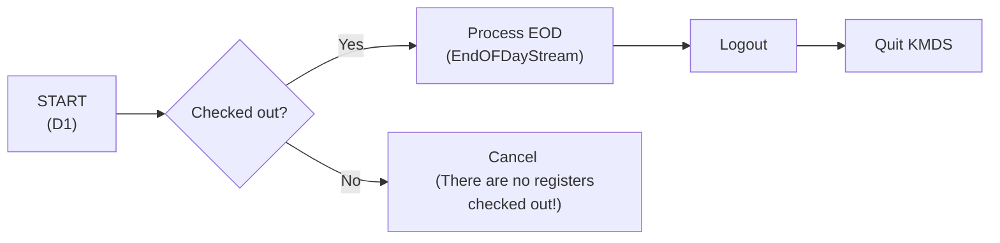
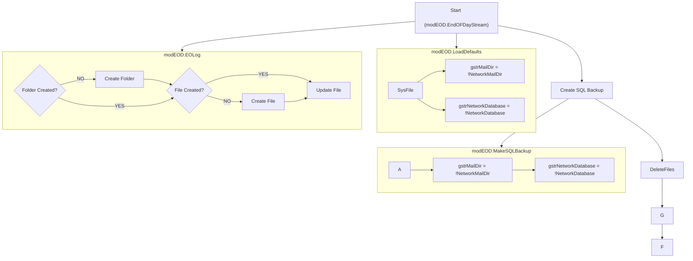
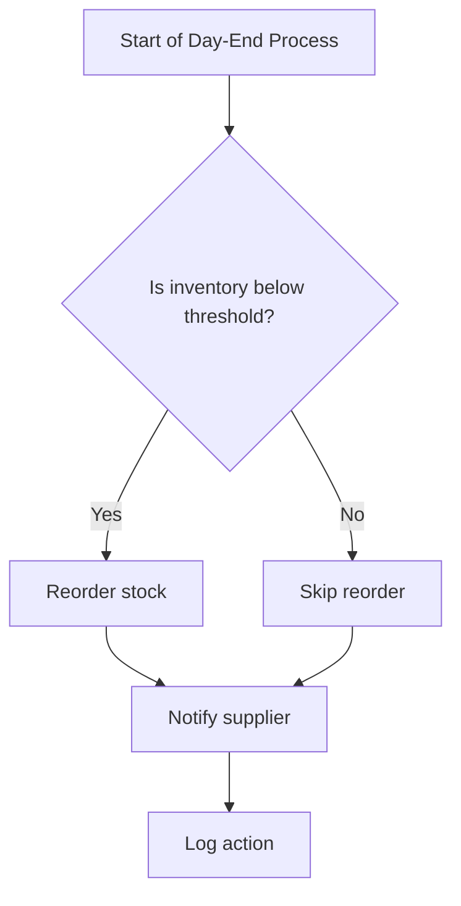
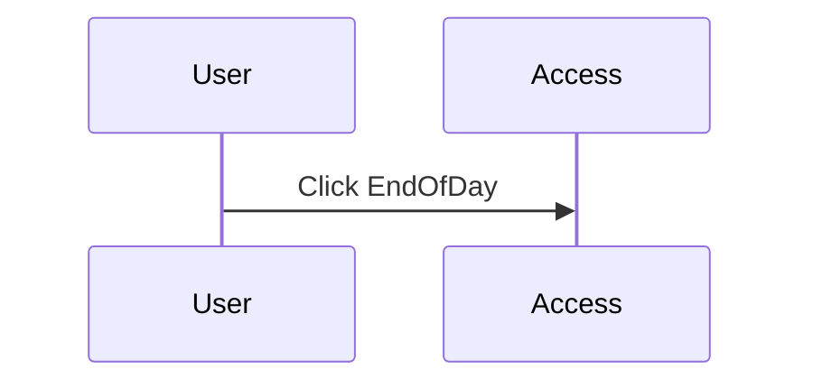
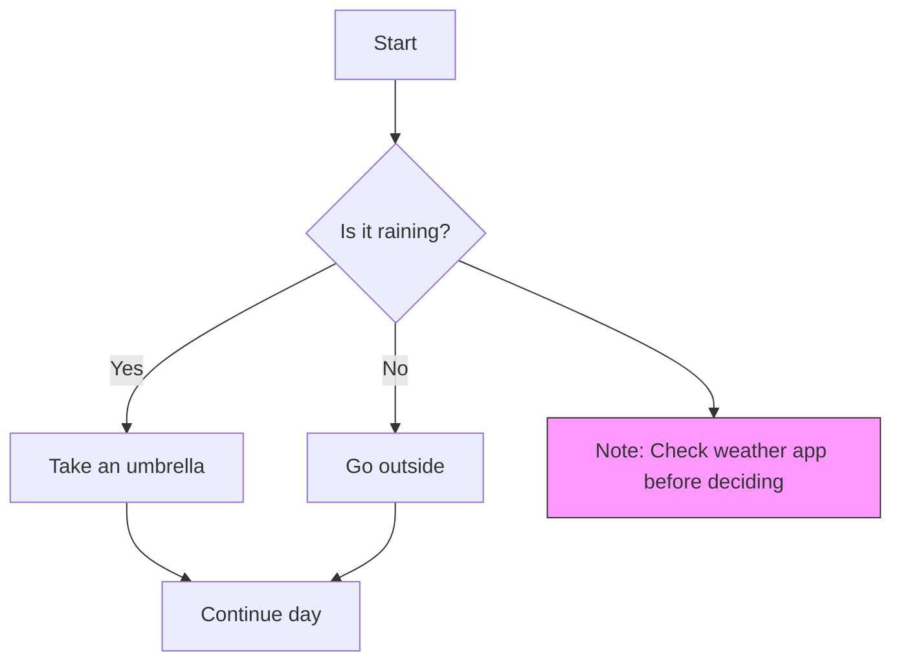
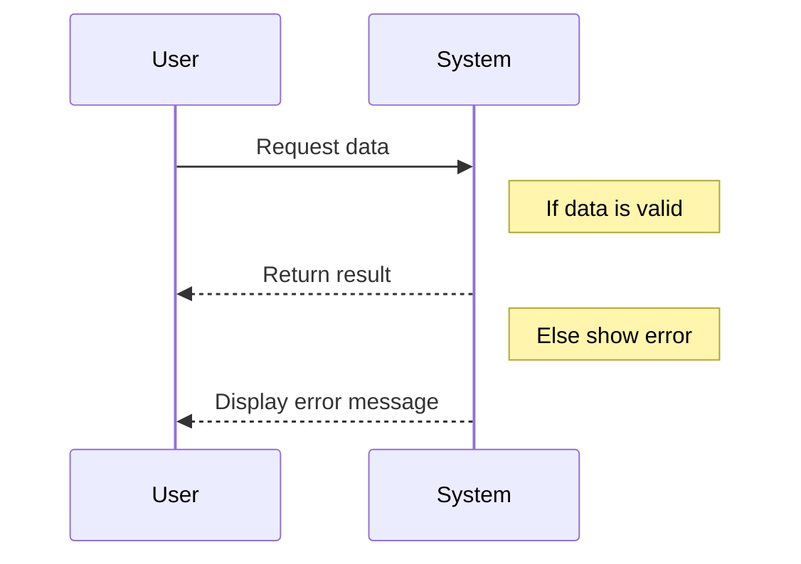

## 🏭 End-of-Day Workflow

This document outlines the steps taken by the system at the end of each business day to ensure inventory levels are accurate and replenishment is triggered when necessary.

---

## 📚 KMDS D1 Menu (`Form_EndOfDay.Form_Open`)

- **Initial Setup**
    - Creates an ADODB recordset to read from the `qryCashRegisters` query.
        ```sql
        SELECT CashSys.ID, CashSys.ComputerName, CashSys.Description, Sysfile.Cr1Installed, Sysfile.Cr2Installed, Sysfile.Cr3Installed, Sysfile.Cr4Installed, Sysfile.Cr5Installed, Sysfile.Cr1CheckOut, Sysfile.Cr2CheckOut, Sysfile.Cr3CheckOut, Sysfile.Cr4CheckOut, Sysfile.Cr5CheckOut
        FROM CashSys, Sysfile
        ORDER BY CashSys.ID;
        ```
- **Register Check**
  - Loops through registers 1 to 5.
  - Checks if any register is checked out (Cr1CheckOut, Cr2CheckOut, etc.).
  - Sets `bAtLeastOneRegisterCheckedOut` to True if any are checked out.
    ```vb
    Select Case !ID
        Case 1
        If !Cr1CheckOut = True Then bAtLeastOneRegisterCheckedOut = True
    ```
- **End of Day Trigger**
  - If at least one register is checked out:
    ```vb
    If bAtLeastOneRegisterCheckedOut Then
    ```
    - Calls **EndOFDayStream** (starts the end of day process).
    - Runs a logout batch file (`kmdslogout.bat`).
        ```vb
        Shell "c:\kmds\kmdslogout.bat", vbNormalFocus
        ```
    - Quits Access (`DoCmd.Quit`).



---

## 🌉 EndOFDayStream (`modEOD.EndOFDayStream`) {#EndOFDayStream}

#### 📝Logging and Setup (`modEOD.EOLog`) {#EOLog}

  - Loads default settings if `gstrMailDir` is empty.
      ```vb
      If gstrMailDir = "" Then LoadDefaults
      ```
      The **`modKMDS.LoadDefaults`** function initializes global variables and system settings for the application.
      ```vb
      rstemp.Open "SysFile", CurrentProject.Connection, adOpenKeyset, adLockOptimistic
      gstrMailDir = !NetworkMailDir
      ```
  - Builds a folder path for the log file using `gstrMailDir` and the current date (year/month/day).
  - Opens (or creates) the log file `EOLog.Txt` in append mode.
      ```vb
      c:\KMDS\reports\2025\08\01\EOLog.Txt
      ```
  - Logs the start of the EOD process.
      ```vb
      EOLog "========================================================="
      EOLog "End of Day - Start"
      EOLog "========================================================="
      ```
  - Loads default configuration values (`gstrMailDir`, `gstrNetworkDatabase`) if missing.
      
      ```vb
      modKMDS.LoadDefaults
      ```
  - Logs the mail directory and network database paths.





---

# Below are sample layout







