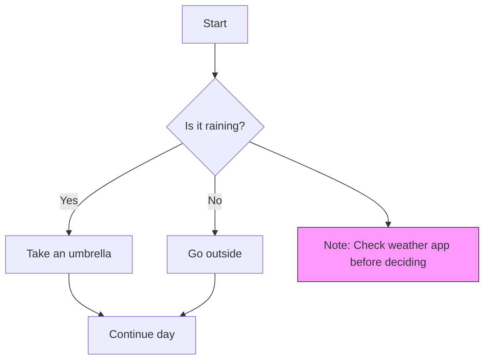

```mermaid
flowchart TD
    A[Start] --> B{Is it raining?}
    B -- Yes --> C[Take an umbrella]
    B -- No --> D[Go outside]
    C --> E[Continue day]
    D --> E

    %% Simulated note
    Note1["Note: Check weather app before deciding"]
    B --> Note1
    style Note1 fill:#f9f,stroke:#333,stroke-width:1px
```